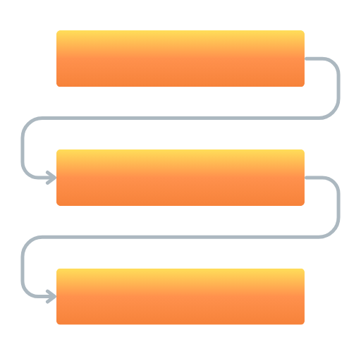
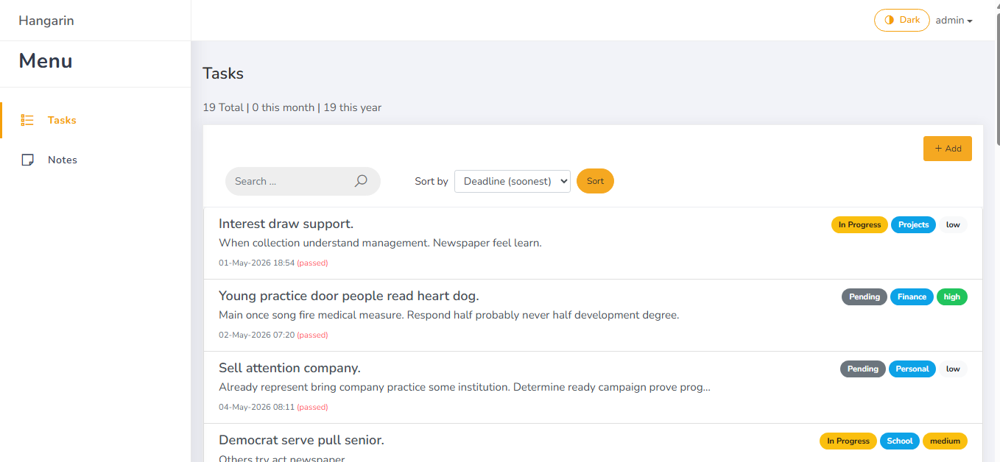
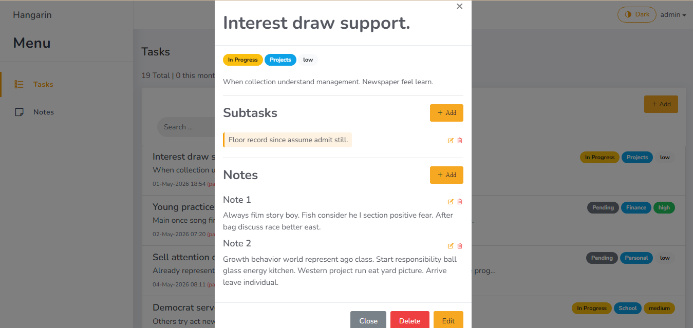
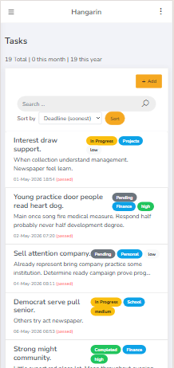
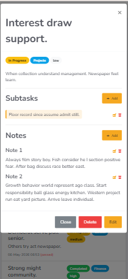
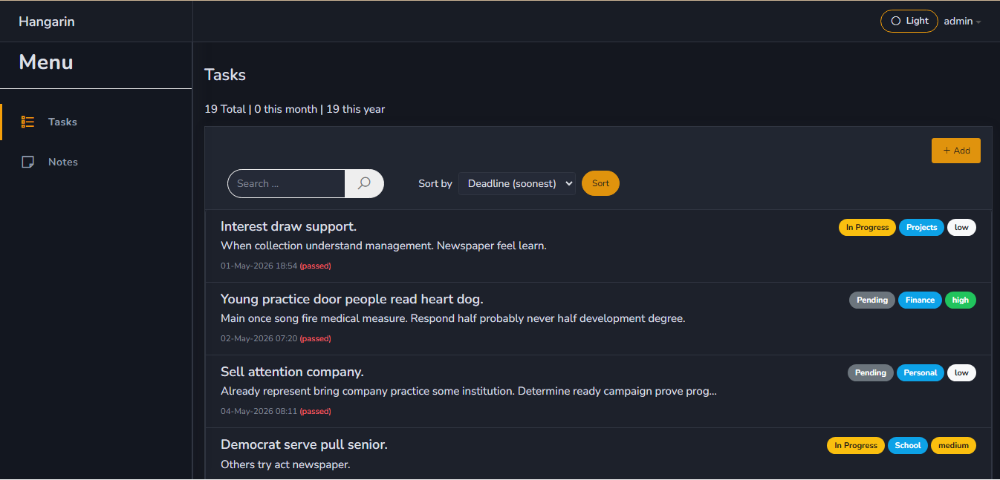
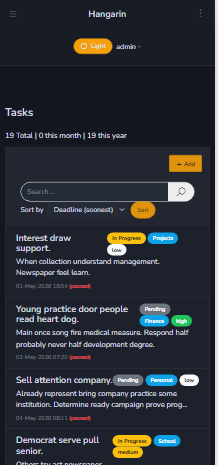

# Hangarin - To Do List App

> *With a busy schedule, tracking your things is easier.*

**Status:** Under Construction 

---

## Features

|  | Feature |
|---|---------|
| 📂 | **Category & Priority Sorting** — Organize tasks by category or urgency |
| 📝 | **Notes Organizer** — Attach notes to any task |
| 🔍 | **Easy Search** — Find anything instantly |
| ✦ | **Dark Mode** — Switch Themes  |

---

## Screenshots

<!-- Replace with actual screenshots -->

#### Large Screes
Front page\

Phone Screen

Dark mode

---

## Tech Stack

<!-- Add your stack here -->
- [ ] HTML/CSS/JavaScript
- [ ] Django
- [ ] Sqlite

---

  Built with ☕ by <a href="https://github.com/">github.com/JuliusMarckArnesto</a>

